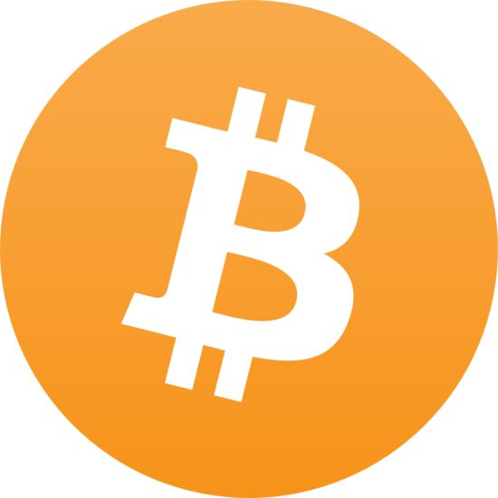

    

    
    
    

# 区块链资源汇总 

## 以太坊开发资源汇总 

[Web3.js、Solidity、Truffle教程及 ETH 开发资源汇总💯](https://github.com/dily3825002/awesome-ethereum)

## 区块链白皮书

下载包体即可
待续
 
## 常用必备

|交易所|场外交易所|资讯|数据查询|
|--|--|--|--|
|[币安：服务最好的币币交易所](https://www.binance.com/?ref=10113920) |[OTCBTC：靠谱场外法币交易网站 ](https://otcbtc.com/referrals/OTCKING)|[MyToken：简洁的币种行情APP](http://mytoken.io/)|[比特币区块浏览器 ](https://btc.com/)|
|[火币：靠谱的交易所](https://www.huobi.pro/zh-cn/)|[OKEX：支持法币和期货的交易所](https://www.okex.com/)|[非小号：强大的行业大数据网站 ](http://www.feixiaohao.com/)|[以太坊区块浏览器](https://etherscan.io/)|
|[OKEX：支持法币和期货的交易所](https://www.okex.com/)|[比特儿：支持法币和各种分叉币](https://gate.io/signup/485240)|[金色财经：区块链第一媒体](http://jinse.com/)|[分叉币大全 ](http://pieifo.com/)|
|[比特儿：支持法币和各种分叉币](https://gate.io/signup/485240)|-|[巴比特：区块链第一论坛 ](http://www.8btc.com/)|[ICOROOT项目评测](https://www.icoroot.com/)|
|-|-|[链向财经：区块链信息服务平台](http://www.chainfor.com/)|[以太坊国内门户网 ](http://ethfans.org/)|
|-|-|-|[BFC：最强的币种大数据网站](https://bitinfocharts.com/zh/)|
 

## 交易所：走好第一步

|国内交易所|国外交易所|场外交易所|
|--|--|--|
|[币安：服务最好的币币交易所](https://www.binance.com/?ref=10113920)|[B网：美国知名头部数字货币平台](https://bittrex.com/)|[OTCBTC：体验最好的场外平台](https://otcbtc.com/referrals/OTCKING)|
|[火币：靠谱的交易所](https://www.huobi.pro/zh-cn/)|[P网：成立于2014年的老牌山寨币平台](https://poloniex.com/)|[LocalBitcoins：全球最大场外平台](https://localbitcoins.com/)|
|[比特儿：支持法币和各种分叉币 ](https://gate.io/signup/485240)|[Bithumb：韩国排名第一的交易平台](https://www.bithumb.com/)|[可盈可乐：支持场外的综合交易所](https://www.coincola.com/mobile/redpacket?ref=bnpm8imB)|
|[OKEX：支持法币和期货](https://www.okex.com/)|[Hitbtc：英国领先的交易平台](https://hitbtc.com/)|[OKEX C2C：OKEX场外](https://www.okex.com/c2c/trade/trade.do)|
|[EXX：可信赖的数字货币交易网 ](https://www.exx.com/r/c4c2539b9f192f47492a15b9afd8a8ea)|[KEX：可充值法币的韩国交易平台](https://www.kex.com/)|[火币 C2C：火币场外ZB ](https://otc.huobi.pro/)|
|[KUCOIN：简单易用的数字货币交易网 ](https://www.kucoin.com/#/?r=E3lswr)|[EtherDelta：去中心化第一交易平台](https://etherdelta.com/)|[C2C：中比特场外](https://vip.zb.com/activity/joinbtc?tuijianid=32ab425f28355704632893ae7eb1cbbc)|
|[ZB：国内老字号中比特合作平台 ](https://vip.zb.com/activity/joinbtc?tuijianid=32ab425f28355704632893ae7eb1cbbc)|[Liqui：乌克兰优秀的交易平台](https://liqui.io/)|[BitcoinWorld：比特币世界场外平台](https://bitcoinworld.com/register?referral=64597)|
|[Bitfinex：经常世界第一的香港交易所](https://www.bitfinex.com/)|[Quoinex：日本最好的持照交易平台](https://quoinex.com/)|[LinkCoin：好用的场外交易平台](https://www.linkcoin.pro/)|
|[AEX：比特时代海外版 ](https://www.aex.com/)|[BIT-Z：全球化数字货币交易平台](https://www.bit-z.com/)|-|
|[ALLCOIN：澳大利亚上市公司交易所 ](https://www.allcoin.com/Account/RegisterByPhoneNumber/?InviteCode=MTQ2OTk4MDgwMDg5Mzgw)|[BitMex：总部位于塞舌尔的交易平台](https://www.bitmex.com/)|-|
|[币赢网：坚挺支持法币的交易所 ](https://www.coinw.com/)|[CME：比特币期货平台](http://www.cmegroup.com/)|-|
|[CEX：币久海外版](https://www.cex.com/)|-|-|
|[BigOne：老猫掌管的币币交易所 ](https://big.one/)|-|-|
|[CoinEgg：聚币国际版](https://www.coinegg.com/)|-|-|
 

## 媒体资讯：识媒体，看币圈

|媒体|微博|订阅号|
|--|--|--|
|[金色财经：币圈国内第一媒体](http://www.jinse.com/)|[财新网：国家媒体，国内币圈政策风向标](https://weibo.com/caixincn?refer_flag=1001030101_)|[白话区块链：币圈最良心公众号，小白首选](https://mp.weixin.qq.com/s/PAJowLo3ECp-zLncvqrSpg)|
|[链向财经：区块链信息服务平台 ](http://www.chainfor.com/)|[南宫远：币圈老资格的比特币踏空者](https://weibo.com/bmngy?refer_flag=1001030103_ )|[BABI财经：币安旗下币圈媒体号 ](https://mp.weixin.qq.com/s/u6zlKg0nqp7Otz2jeYmuWw)|
|[巴比特论坛：区块链国内第一论坛 ](http://8btc.com/?fromuser=%BC%C5%C4%AF%BB%F0%C9%BD)|[宝二爷：比特币上帝分叉发起人](https://weibo.com/u/5941645212?refer_flag=1001030102_)|[巴比特资讯：巴比特旗下公众号 ](https://mp.weixin.qq.com/s/52fzEwKm8inn7KYPq0DSmw)|
|[BTC123：比特币综合信息网](https://www.btc123.com/)|[何生：币圈坚持直播最长的人](https://weibo.com/u/2393473121?refer_flag=1001030102_ )|[未来虚拟币：大炮评级，精彩料多](https://mp.weixin.qq.com/s/StSRVQ39qZvhqVA3xP9bRA)|
|[币乎：有营养的币圈社区 ](https://zt.bihu.com/?id=25175)|[杨林科：原比特币中国CEO](https://weibo.com/yanglinke?refer_flag=1001030102_)|[区块链铅笔：万象投资的媒体 ](https://mp.weixin.qq.com/s/uoaIwprpeExTthrbV4e5CA)|
|[币问：币圈知乎 ](https://www.bitask.org/)|[比特吴](https://weibo.com/wuhanaixin?refer_flag=1001030101_ )|[腾讯可信区块链：腾讯区块链官方号 ](https://mp.weixin.qq.com/s/HV_6ttZuzY1SHX2btog7bQ)|
|[区块链铅笔：区块链技术讨论社区 ](http://chainb.com/)|[何一：币安合伙儿人，首席客服申](https://weibo.com/lilithhe?refer_flag=1001030102_)|[Hi区块链 NEO](https://mp.weixin.qq.com/s/koy-e2TnLM7JcLVVBmG-wA)|
|[币看：比特币资讯及工具综合门户](https://www.bitkan.com/)|[屠青春：博士，投票链创始人](http://weibo.com/MyBitcoin?refer_flag=1001030101_ )|[智能经济：NEO官方公众号，活动多](https://mp.weixin.qq.com/s/ZWCmZnAwHYruvMYzxZ9HzA)|
|[比特头条：区块链界的头条 ](http://www.bitett.com/)|[江卓尔：矿池大佬，BCH支持者](https://weibo.com/ltc1btc?refer_flag=1001030101_)|-|
|[比特之家：比特币门户网 ](http://www.btc798.com/)|[比特币秋山君](https://weibo.com/coinxun?from=profile&amp;wvr=6 )|-|
|[EthFans：以太坊中文门户 ](http://ethfans.org/)|[孙宇晨：90后网红创业者，波场创始人](https://weibo.com/shixb90?refer_flag=1001030101_)|-|
|[CoinDesk：国外比特币综合门户网站](https://www.coindesk.com/)|[比特币莱特币](https://weibo.com/xxszjs?topnav=1&amp;wvr=6&amp;topsug=1&amp;is_hot=1 )|-|
|[BitcoinTalk：全球第一区块链论坛 ](https://bitcointalk.org/index.php?board=30.0)|[暴走恭亲王：传奇人物，Cybex创始人](https://weibo.com/p/1005051402559840/home?from=page_100505&amp;mod=TAB&amp;is_hot=1#place)|-|
|[Reddit：国外热门的比特币讨论组 ](https://www.reddit.com/)|-|-|
|[未来财经：简洁风格的财经媒体](http://www.weilaicaijing.com/)|-|-|

 

## 炒币工具：工欲善其事，必先利其器

|币种行情|钱包工具|区块查询|量化交易|
|--|--|--|--|
|[非小号：强大的行业大数据网站](https://www.feixiaohao.com/)|[imToken：国内最流行的以太坊钱包APP](https://token.im/)|[BTC浏览器](https://btc.com/)|[BotVS：首家数字货币量化工具，功能强大](https://www.botvs.com/)|
|[AiCoin：原SOSOBTC，支持APP ](https://www.aicoin.net.cn/)|[MyEtherWallet：最好用的以太坊网页钱包比特币官方钱包](https://www.myetherwallet.com/)|[ETH浏览器](https://etherscan.io/)|[比特币精灵：简单好用的对冲和搬砖工具](http://www.btcjl.com/)|
|[MyToken：小巧好用的行情查看APP ](https://mytoken.io/)|[BlockChain：好用的多币种网页钱包](https://bitcoin.org/zh_CN/choose-your-wallet)|[LTC浏览器](https://chainz.cryptoid.info/ltc/)|[米框量化：私人量化交易平台](https://www.ricequant.com/)|
|[CoinMarketCap：国外老牌大数据网站](https://coinmarketcap.com/)|[莱特币客户端以](https://blockchain.info/zh-cn/wallet/#/)|[QTUM浏览器](https://qtumexplorer.io/)|[阿布量化：综合的开源交易系统](http://www.abuquant.com/)|
|[BTC123：比特币价格汇总及行情图表 ](https://www.btc123.com/trades)|[太坊官方客户端](https://electrum-ltc.org/)|[USDT浏览器](http://omnichest.info/lookupsp.aspx?sp=31)|[果币网：比特币量化自动交易平台](https://guobinet.com/)|
|[Bitkan：主流币种实时数据汇总 ](http://bitkan.com/price)|[比特派：国内功能最强大的钱包](http://bitpie.com/)|[小蚁NEO浏览器](http://antcha.in/)|[币量化：比特币、莱特币量化自动交易平台](http://www.bilianghua.com/)|
|[Cryptowat：热门资产专业行情图表 ](https://cryptowat.ch/)|[Bither：国产开源比特币钱包,无需同步区块](https://bither.net/)|[BitInfoCharts综合浏览器](https://bitinfocharts.com/zh/)|[Samaritan：简单易用的数字货币量化框架](http://samaritan.stockdb.org/)|
|[Investing：独有实时买入卖出分析](https://cn.investing.com/)|[BitBank：比银集团旗下比特币热钱包](https://www.bitbank.com/)|[BitBank综合浏览器](https://block.bitbank.com/)|[比特一下：简单好用的搬砖工具](http://www.bityixia.com/)|
|-|[莱特币官方开源钱包](https://litecoin.org/cn/)|-|-|
|-|[Jaxx：支持几十种资产的优秀钱包](https://jaxx.io/)|-|-|
|-|[AToken：支持几十种资产的钱包](https://www.atoken.com/)|-|-|
|-|[酷神钱包：超酷硬件钱包P](https://www.coldlar.com/)|-|-|
|-|[PO.IM ：币信海外版钱包](https://po.im/)|-|-|

 

## 大数据

- [比特币富豪榜](http://qukuai.com/top)
- [以太坊富豪榜](https://etherscan.io/accounts)
- [交易所交易量排行榜](https://coinmarketcap.com/exchanges/volume/24-hour/)
- [主流币种活跃地址数](https://bitinfocharts.com/zh/comparison/activeaddresses-btc-eth-bch-ltc-dash-xmr.html)
- [上千个DAPP大全](https://www.stateofthedapps.com/)
- [Erc20代币大全](https://etherscan.io/tokens)
- [主流币种转账手续费概况](https://bitinfocharts.com/zh/comparison/transactionfees-btc-eth-bch-ltc-dash-xmr.html)
- [矿池算力排行榜](https://btc.com/stats/pool)
- [以太坊重要数据实时可视化图表 ](https://ethstats.net/)
- [比特币区块数据](https://btc.com/stats/block-size)
- [比特币堵塞监视](https://btc.com/stats/unconfirmed-tx)
- [云养猫数据分析 ](http://bitgame.pro/user?lang=zh-cn)
- [可视化的ICO发展历史 ](https://elementus.io/token-sales-history)
- [区块链相关微信指数 ](http://index.wxadd.com/rank/bitcoin)
- [区块链相关百度指数](http://index.baidu.com/?tpl=trend&amp;type=0&amp;area=0&amp;time=13&amp;word=%C7%F8%BF%E9%C1%B4%2C%B1%C8%CC%D8%B1%D2%2Cico%2C%D2%D4%CC%AB%B7%BB)

 

## 自媒体：币圈里，信息就是钱

|个人订阅号|博客、简书|知识星球|
|--|--|--|
|[猫说：2017年无数新韭菜的启蒙公众号](https://mp.weixin.qq.com/s/Y_IrNMPfCsysv4TLWnEUqQ)|[汪晓明博客：大量系统的区块链技术教程](http://wangxiaoming.com/)|[火山夫妇炒币直播间](https://t.zsxq.com/aMz33Bu)|
|[闪电HSL：技术大神，BCH支持者](https://mp.weixin.qq.com/s/eG4434YSihvV_CmDRrfjMw)|[Elwin随心博客](http://blog.csdn.net/elwingao )|[BNB粉丝圈](https://t.xiaomiquan.com/3rf2rBi )|
|[数字货币趋势狂人：坚持日更的行情分析师](https://mp.weixin.qq.com/s/u1auM4i5PJEmybMkONmlNA)|[黎跃春博客：人称春哥，孔壹学院创始人](http://liyuechun.org/#blog)|[区块先锋：烧哥管理的几千人的大星球](https://t.xiaomiquan.com/VFeQZba)|
|[苏江：币圈独立思考者，篇篇精华](https://mp.weixin.qq.com/s/wBF4reersATh-6cuNXPqZw)|[猫友圈：人多，热闹，但老猫不常出现](https://t.xiaomiquan.com/7AAmea6)|[区块链观察者：人不多，但圈主经常神预测](https://t.xiaomiquan.com/fi2vNJi )|
|[Miao说:区块链老董](https://mp.weixin.qq.com/s/fcqRi5d61Se5vBPq2B9AIg)|[闪电比特币圈：大头经常出现](https://t.xiaomiquan.com/3ZBURbY )|[大炮矿社(IPFS)：IPFS及其挖矿的星球](https://t.xiaomiquan.com/ZnAMFIQ)|
|[币计：币圈八卦，热点追踪小明微思考](https://mp.weixin.qq.com/s/vEy187_3thDgXdEcoHW9Ug)|[区块链爱好者](https://t.xiaomiquan.com/ieUniuv)|-|
|[李白话日常](https://mp.weixin.qq.com/s/xl4QRQQcSThBb_z4O7ib6A)|[海外币圈：用心管理的](https://t.xiaomiquan.com/rRVvZVr )|-|
|[几米一回头：分享各种赚钱的故事和技巧](https://mp.weixin.qq.com/s/n_dX2RU5i7oyajLmlrrWPw)|-|-|
|[一二：已经出书的杰出90后，文章很好](https://mp.weixin.qq.com/s/m1NCDcs-f-WmnTtq35YwvA)|-|-|
|[蓝狐笔记](https://mp.weixin.qq.com/s/2BTcjsAXCVfz63IR6Kw3qg)|-|-|
|[45区](https://mp.weixin.qq.com/s/C5cnthAx6XV0m-oSbuShrA)|-|-|
|[币虎：靠谱项目带投](http://mp.weixin.qq.com/s/HD6-TgJo3ejquZUbO0EzZg )|-|-|
|[王团长区块链日记：真实的投资日记](https://mp.weixin.qq.com/s/YT4yQFu9Y0Vx-s_tHWvixA )|-|-|

 

## 业界公司：向埋头做事的行业公司敬礼

|矿池矿机|技术研发|项目评测|
|--|--|--|
|[蚂蚁矿机](https://www.bitmain.com/)|[布比区块链](http://www.bubi.cn/)|[ICOROOT：国内最专业的项目评级](https://www.icoroot.com/)|
|[AntPool蚁池 ](https://antpool.com/home.htm)|[万象区块链]( http://www.wxblockchain.com/)|[Crushcrypto：国外最好最全的项目信息]( https://crushcrypto.com/)|
|[BTC矿池 ](https://pool.btc.com/)|[腾讯区块链](https://trustsql.qq.com/)|[52ICOIFO分叉大全：各种币的分叉信息一网打尽](http://www.52ico.com/)|
|[ViaBTC矿池](https://pool.viabtc.com/)|[云象区块链]( http://www.yunphant.com/)|[TopIcoList]( http://pieifo.com/)|
|[F2Pool 鱼池](https://www.f2pool.com/)|[复杂美区块链](http://www.33.cn/)|[IcoRating](https://topicolist.com/)|
|[莱比特矿池 ](http://www.btc.top/)|[井通区块链]( https://www.jingtum.com/)|[IcoWeb]( https://icorating.com/)|
|[国池 ](https://pool.btcchina.com/)|[太一云](https://taiyiyun.com/)|[IcoAlert](http://www.icoweb.co/)|
|[算力巢](https://www.hashnest.com/)|[安链云]( https://www.anlink.com/)|[Icodrops：国外权威项目评级网站 ]( https://www.icoalert.com/)|
|[算力吧 ](https://pow8.com/)|-|[Coingecko：最新国外项目众筹列表](http://icodrops.com/)|
|[BTC难度算力 ](http://bitcoin.sipa.be/)|-|-|
|[MiningPool ](https://miningpoolhub.com/)|-|-|
|[ETC矿池](http://www.91pool.com/)|-|-|
|[熊猫矿机 ](http://pandaminer.com/)|-|-|
|[币信矿池 ](https://pool.bixin.com/home)|-|-|
|[星火矿池](https://eth.ethfans.org/)|-|-|

 

## 书籍：沉下心，读本书

|纸质书|电子书|中文白皮书精选|
|--|--|--|
|[比特币：一个虚幻而真实的金融世界 ](https://e.jd.com/30161987.html)|[精通比特币第二版 ](http://book.8btc.com/books/6/masterbitcoin2cn/_book/)|[ETH白皮书 ](http://ethfans.org/wikis/%E4%BB%A5%E5%A4%AA%E5%9D%8A%E7%99%BD%E7%9A%AE%E4%B9%A6)|
|[区块链革命 ]( https://item.jd.com/12033804.html )|[高盛区块链报告 ]( http://book.8btc.com/books/1/gaosheng_blockchain_report/_book/)|[EOS白皮书 ]( http://chainx.org/paper/index/index/id/20.html)|
|[区块链：新经济蓝图及导读 ](https://item.jd.com/10401239824.html)|[央行数字货币研究与探讨 ](http://book.8btc.com/books/6/cnfinance201617/_book/)|[星际文件白皮书 ](http://chainx.org/paper/index/index/id/13.html)|
|[区块链：技术驱动金融]( https://item.jd.com/12014042.html )|[Solidity智能合约编程指南]( http://book.8btc.com/books/6/solidity-zh/_book/)|[Polkadot白皮书]( http://chainx.org/paper/index/index/id/6.html)|
|[区块链：重塑经济与世界 ](https://item.jd.com/11922237.html)|-|[Kyber去中心化交易所白皮书 ](http://chainx.org/paper/index/index/id/26.html)|
|[区块链：从数字货币到信用社会 ]( https://weidian.com/item.html?itemID=1878011740 )|-|[流量矿石白皮书]( https://minerdl.yunfan.com/miner/lltoken/uploadfile/pdf/llt_white_paper.pdf)|
|[区块链：定义未来金融与经济新格局 ](https://item.jd.com/11936509.html)|-|-|
|[区块链数字货币投资指南]( https://e.jd.com/30373377.html )|-|-|
|[如何投资数字货币 ](https://item.jd.com/12114952.html)|-|-|
|[区块链开发指南 ]( https://weidian.com/item.html?itemID=2133865911 )|-|-|
|[区块链技术指南 ](http://item.jd.com/12007317.html)|-|-|
|[区块链核心算法解析]( https://item.jd.com/13612791347.html )|-|-|
|[区块链技术原理及底层架构 ](https://item.jd.com/12188306.html)|-|-|
|[区块链原理、设计与应用]( https://item.jd.com/12159265.html )|-|-|

 

## 其他

|精品游戏|精品文章|
|--|--|
|[Solidity在线开发 ](https://ethereum.github.io/browser-solidity/#version=soljson-v0.4.18+commit.9cf6e910.js)|[TED关于区块链的入门科普视频 ](https://weibo.com/tv/v/FzcPgFU1y?fid=1034:01ea26af661b0e4bf56a63f6628fba57)|
|[ETH养猫游戏 ]( https://www.cryptokitties.co/)|[比特币的基因 ]( https://mp.weixin.qq.com/s?__biz=MzIyNTY0MDM5OQ==&amp;mid=2247483975&amp;idx=1&amp;sn=bc0217c669b4089df132b4d4f2cf3768&amp;chksm=e87de8e7df0a61f1126b772f228891d0c74b98c0d3d181a2ca80e892dfcede11f6fa36d47c89#rd)|
|[ETH养猫游戏数据分析 ](http://bitgame.pro/user?lang=zh-cn)|[指责比特币挖矿耗电是无理取闹 ](https://mp.weixin.qq.com/s?__biz=MzIyNTY0MDM5OQ==&amp;mid=2247483978&amp;idx=1&amp;sn=a1d7e7e5762ccd8d01bd6f7dcf3cc5ed&amp;chksm=e87de8eadf0a61fc70d45f2939e86566e09e437db62ae2e088150093452d683b8cb8579dd897#rd)|
|[中本聪骰子 ]( https://www.satoshidice.com/)|[深度剖析共识机制和拜占庭将军问题]( https://mp.weixin.qq.com/s?__biz=MzIyNTY0MDM5OQ==&amp;mid=2247483981&amp;idx=1&amp;sn=60f84950d01d2e57bea2a96c654de664&amp;chksm=e87de8eddf0a61fb4dc387ff21d54de89508707eeaf5116b9e8e9d7b46de4db37a8543a2d32b#rd)|
|[免费获取比特币 ](https://freebitco.in/)|[比特币硬骨头：非对称加密技术 ](https://mp.weixin.qq.com/s?__biz=MzIyNTY0MDM5OQ==&amp;mid=2247483984&amp;idx=1&amp;sn=2eb00844811d010866bc7490dd6ae1d7&amp;chksm=e87de8f0df0a61e603fb4e0d21f77a915c4b847436e295236b9fd7c9e770297c0f93806fceae#rd)|
|[BTC RPG 游戏]( http://pokebits.com/)|[中心化 VS 去中心化 ]( https://mp.weixin.qq.com/s?__biz=MzIyNTY0MDM5OQ==&amp;mid=2247483987&amp;idx=1&amp;sn=b1f75b2893ddb7822ce7b72b2f59f4c9&amp;chksm=e87de8f3df0a61e5548786cd8496aabec63cef182a7911a92cf78ec9e8799dce858ad2744738#rd)|
|[BTC虚拟酒吧 ](http://virtualpub.io/)|[比特币的安全问题 ](https://mp.weixin.qq.com/s?__biz=MzIyNTY0MDM5OQ==&amp;mid=2247483990&amp;idx=1&amp;sn=a57e7b04f892da4a97979669c3b63ff4&amp;chksm=e87de8f6df0a61e01a081ef1b4fc03ac24348c4e9b948422f1044e7992e5850bb0c16a6e780f#rd)|
|[BTC采矿游戏 ]( http://freebtcmine.com/)|[比特币分叉的背景与历史渊源]( https://mp.weixin.qq.com/s?__biz=MzIyNTY0MDM5OQ==&amp;mid=2247483995&amp;idx=1&amp;sn=4c85f4c43c912aef01d12b4e09cd2004&amp;chksm=e87de8fbdf0a61edf350def88a324c575961faab713c23ced5dab68e2af6f881e0e1609c597f#rd)|
|[多人 BTC RPG](http://satoshiwars.com/)|[面对比特币分叉,我们要保持独立思考 ](https://mp.weixin.qq.com/s?__biz=MzIyNTY0MDM5OQ==&amp;mid=2247484001&amp;idx=1&amp;sn=b687c0c93474ac89945834298d116c5a&amp;chksm=e87de8c1df0a61d7ba1c7b626a35eac2e54ba0d8b4428c8a6e077d89ce5cc66fea772301ffe7#rd)|
|[BTC赛车游戏 ]( http://cryptoracers.com/)|[深圳车牌与比特币 ]( https://mp.weixin.qq.com/s?__biz=MzI0NjYzOTQ1OQ==&amp;mid=2247484223&amp;idx=1&amp;sn=7363f47c65ca3a292bf18d13b9847f9f&amp;chksm=e9bd7d33decaf42570d9f1750703fa0aed1a820afe69b868ff7ecc58d5c1e3e26619c620e8be&amp;mpshare=1&amp;scene=1&amp;srcid=1213NIin9Rn4yZdEfzwdm14D#rd)|
|[BTC雨伞游戏 ](http://rainpool.io/)|[比特币每天都在刷新我对它的认知 ](https://mp.weixin.qq.com/s?__biz=MzAwNTU2ODQ2Mw==&amp;mid=2651979176&amp;idx=1&amp;sn=5126d668d07c6763fdc66709b69c68a7&amp;chksm=80ffff08b788761ebae3abc498e0d16aefc5f48b94febbe0c660993d17123629c64479acb7b5&amp;mpshare=1&amp;scene=1&amp;srcid=1213XrrxQkDs3ub0oDiX0kGT#rd)|
|[BTC战争游戏 ]( http://gamefaucet.com/)|[区块链下真正靠谱的落地创业机会](https://mp.weixin.qq.com/s?__biz=MzAwNTU2ODQ2Mw==&amp;mid=2651979182&amp;idx=1&amp;sn=b4e00c32bb508a3ae0580fa1d848ac7d&amp;chksm=80ffff0eb7887618409e70bd3f52466143df8c1d4ae72b50067aa39ed9b1daf6daa5d8c5ba9d&amp;mpshare=1&amp;scene=1&amp;srcid=1213MLeKUna5dkuvEwEYDQxL#rd)|
|[一键生成分叉币 ](https://forkgen.tech/)|[怎样才能摆脱“韭菜”思维? ](https://mp.weixin.qq.com/s?__biz=MzAxMjMzMDg4OA==&amp;mid=2650539156&amp;idx=1&amp;sn=bda79443e43d17cffc4a2a2d0f14d608&amp;chksm=83bbd673b4cc5f65b275ffbfeab5f15706aafb83331abaa20eed429cf880e265b4b4764ebf6c&amp;mpshare=1&amp;scene=1&amp;srcid=1214FfHNORy7zgYKQGUKGcyx#rd)|
|[招财猫：网易的第一款区块链游戏 ]( http://bi.163.com/)|[区块链资产的配置逻辑（上） ](https://mp.weixin.qq.com/s?__biz=MzAxMjMzMDg4OA==&amp;mid=2650538875&amp;idx=1&amp;sn=f42c21c8c4b49025b87c61026f40fd8d&amp;chksm=83bbd19cb4cc588ad0b67f588912d1566feb954e4aac137769de2bb35b7c20040b8be8b78fdf&amp;mpshare=1&amp;scene=1&amp;srcid=1214E4Ggdtmks24CC2FMGROK#rd)|
|[公信宝布洛克城，入住可挖GXS！](https://wechat.gxb.io/activity2/#/?token=e41e9105867a238c1206f20f03b63ac4e743539984df6830d72776c5029484db)|[区块链资产的配置逻辑（下） ](https://mp.weixin.qq.com/s?__biz=MzAxMjMzMDg4OA==&amp;mid=2650538880&amp;idx=1&amp;sn=ae74dea790873f975ff4bcadb9491e69&amp;chksm=83bbd167b4cc587170b111d532f12cc6115ea84ea4e435e5bef462e7362bd1a41cd368e3ad4a&amp;mpshare=1&amp;scene=1&amp;srcid=1214pHSiSyDYnGN1IT1bR57V#rd)|
|-|[技术大神“云风”2011年关于BTC的分析]( https://blog.codingnow.com/2011/05/bitcoin.html)|
|-|[长铗2011年的投资建议（史诗级评论）](https://www.zhihu.com/question/19982269)|
|-|[2017年你为什么错过比特币？](https://mp.weixin.qq.com/s?__biz=MzIyNDk1NzU4OA==&amp;mid=2247484665&amp;idx=1&amp;sn=c0e3a0a9b72315065920f9aeeb4c144d&amp;chksm=e8064102df71c8148fc42b200e8b30276d0df8803bd1e3a18330bda3a13c46445aa8663b9d88&amp;mpshare=1&amp;scene=1&amp;srcid=1214THPGs7RcH0Q3VIqX4sMr#rd)|
 

## Tips

如果你有更多信息请发给我
邮箱：dily3825002@163.com